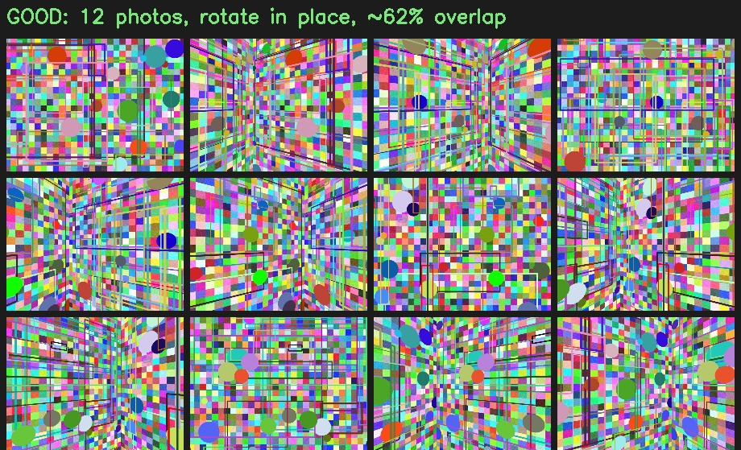
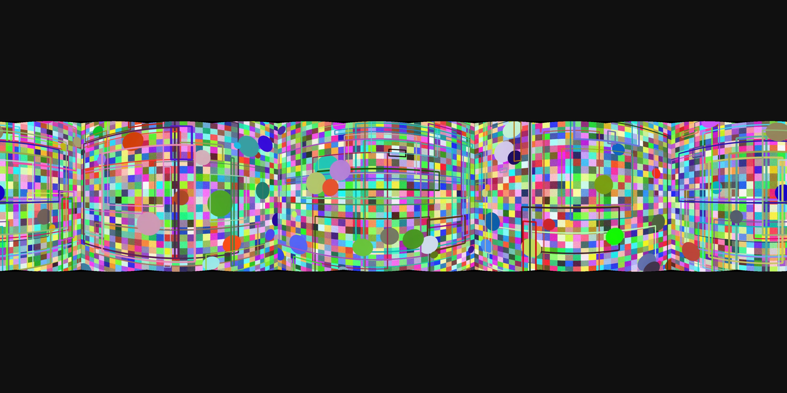
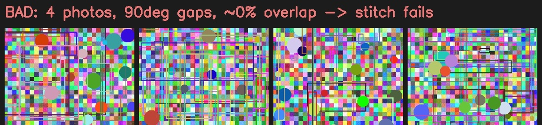
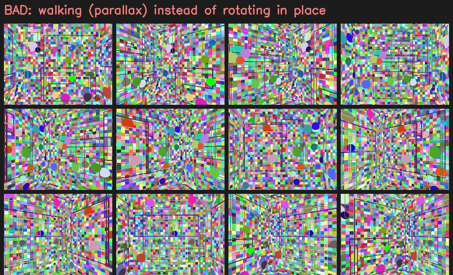

# Capture Guide — phone photos → 360° panorama

How to shoot the **10–20 overlapping photos** the stitcher turns into one
equirectangular panorama (one room = one panorama). Follow this and the stitch
"just works"; ignore it and it fails or ghosts.

---

## The one rule: **rotate in place, don't walk**

A panorama is built from **pure rotation** — every photo shares the same optical
center, so the images are related by a rotation and line up perfectly. The moment
you *translate* (step sideways, walk around), near and far objects shift by
different amounts (**parallax**) and the stitch ghosts or fails.

> Pivot the phone around its lens. Turn your body in place; don't orbit the room.

---

## Capture pattern

1. **Stand still** in the middle of the room (or wherever you want the viewpoint).
2. **Hold the phone portrait** (vertical) — more vertical coverage per shot.
3. **Lock exposure & focus** (tap-and-hold on most phones) before you start, so
   brightness stays consistent for clean blending.
4. **One horizontal ring:** take a photo, rotate ~**30°**, repeat — all the way
   around (**~12 photos** for a full 360°). Keep the horizon roughly level.
5. *(Optional, fuller sphere)* add a ring tilted **~45° up** and one **~45° down**,
   plus a straight-up and straight-down shot (~30 photos total).
6. Walk to the next room and repeat — each becomes another scene you link with hotspots.

### Numbers that matter
| Setting | Target | Why |
|---|---|---|
| Photos per 360° | **12** (10–20 ok) | enough overlap without too many seams |
| Yaw step | **~30°** | with a ~80° phone FOV this gives generous overlap |
| **Minimum overlap** | **≥ 40%** between neighbours | below this, alignment fails |
| Overlap at 30° step | ~62% | comfortable margin |
| Movement of the lens | **≈ 0** | translation = parallax = ghosting |

---

## Good vs bad captures

**✅ Good** — 12 photos, rotating in place, ~62% overlap → clean stitch:

Result (equirectangular, loads straight into the sphere viewer):

**❌ Too few / no overlap** — 4 photos with 90° gaps → the stitcher can't find
matching features and **fails** (`need more images`):

**❌ Walking instead of rotating** — translating the camera introduces parallax.
In a real room this causes **ghosting and misalignment** (and often outright
failure). Always rotate in place:

> Regenerate these with `cd backend && python scripts/make_capture_examples.py`.

---

## What the backend tells you

`POST /panorama` returns debug info for every attempt:

| Field | Meaning |
|---|---|
| `num_images_used` | how many of your photos were usable / matched |
| `num_features` / `num_matches` | feature detections and matched features (overlap health) |
| `status` / `reason` | `ok`, or a plain-English failure cause |
| `output_resolution` | final equirectangular size (e.g. `4096×2048`) |
| `vertical_fov_deg` | vertical coverage; the rest is filled with neutral caps |

### Troubleshooting by `reason`
- **"need more images"** → add more shots / smaller rotation step (more overlap).
- **"could not align images — too much parallax"** → you walked; rotate in place.
- **"camera parameter estimation failed"** → uneven sweep or moving subjects (people,
  curtains); re-shoot a steady, even ring.

---

## Known limitations (POC)
- Output is a **horizontal band** with neutral floor/ceiling caps unless you also
  shoot up/down rings. Full seamless poles need a multi-ring capture (or Hugin).
- A full-circle horizontal sweep is assumed for correct 360° wrap; a partial sweep
  shows neutral fill where you didn't capture.
- A **360° camera** (Ricoh Theta, Insta360) skips all of this — just upload its
  equirectangular image via **Upload 360°**.
